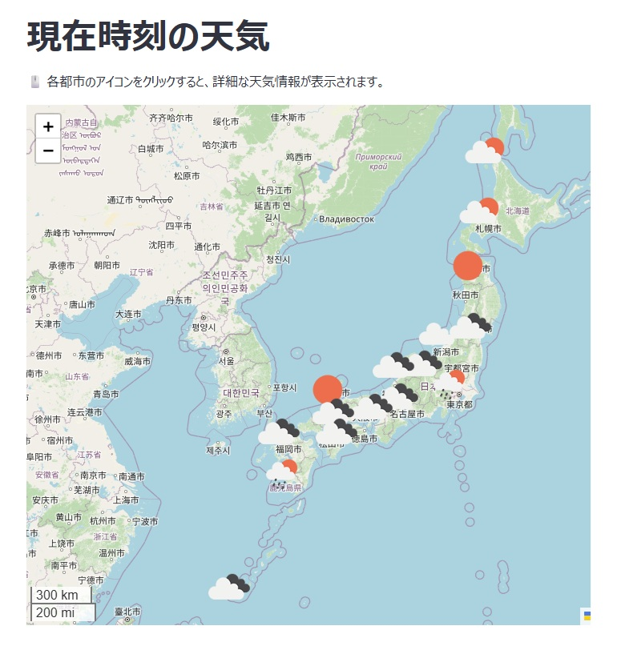

# 現在時刻の天気アプリ
Python、Flaskの練習を兼ねて作りました。第二弾。  
Streamlitにて公開しています → [リンク](https://weatherapi-fceebvwkapd7uzgpytk2gy.streamlit.app/)

## スクリーンショット

  

## 仕様
- OpenWeatherのAPIよりアクセス時点での天気情報を取得しています。

## 技術スタック
- Python 3.12.6
- folium 0.19.5
- streamlit 1.45.1
- streamlit-folium 0.25.0

## notebookについて
OpenWeatherのAPIの挙動確認や、APIに渡すための座標データなどの整形をnotebookにて行っています。  
notebookの挙動を確認したうえで、最終的にapp.pyへ転記しています。  

- sandbox_api_old.ipynb   
  OpenWeatherに公開されている世界全体の都市データ[(リンク)](https://bulk.openweathermap.org/sample/)より、  
  日本の都市だけを抽出するためのnotebook。  
  元となる都市データ（city.list.json.gz）は非常に重く、ディレクトリに含めていません。 

- sandbox2.ipynb   
  sandbox_api_old.ipynbで抽出した都市データ[(city.list_JP.json)](city.list_JP.json)には   
  日本全土の都市データが含まれており、このままでは地図へ反映しても見栄えが非常に悪く、  
  またAPIキーを過剰に消費してしまうので、一部都市に限って出力するためのjsonファイル[(location.json)](location.json)を作成する。   
  
- sandbox3.ipynb   
  location.jsonにOpenWeatherのAPIで取得した天気情報を乗せ、foliumの地図に表示する方法を検討するnotebookです。
  
## 作成経緯
当初はPythonの勉強を兼ねて、Pythonでデータを整形してフロントエンド（Reactなど）に渡すことを考えていました。   
ただstreamlitでwebアプリ化できると分かり、今回の公開につながっています。  

## ライセンス
このプロジェクトは [MITライセンス](LICENSE) のもとで公開されています。